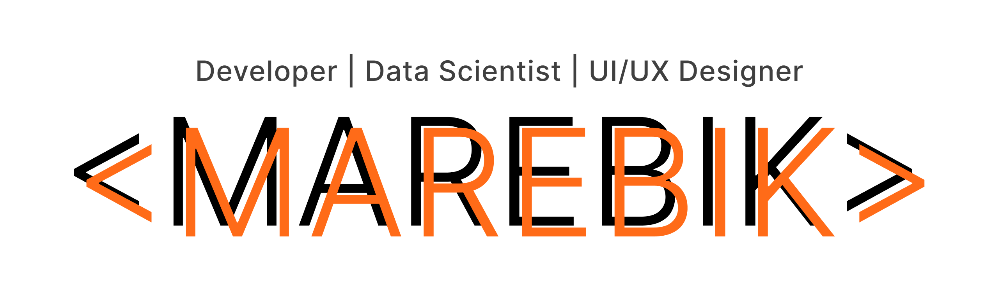

# Developer | Data Scientist | UI/UX Designer 💻

  

## Projects 📝

On this profile, you'll find a collection of projects that reflect my journey as a developer. These projects showcase my skills, creativity, and problem-solving abilities. I strive to work on a diverse range of projects, encompassing various domains and technologies. I like working on web applications as a back-end developer or sometimes as a front-end developer.

## Competitive Programming and Hackathons 🏆

I have a knack for competitive programming and enjoy participating in coding competitions. It's an exciting way to challenge myself, enhance my problem-solving skills, and learn from fellow programmers. Additionally, I find great inspiration and motivation in participating in hackathons, where I get to collaborate with talented individuals to create innovative solutions within a limited timeframe.

## Get in Touch 📧

I'm always open to collaboration, feedback, or just having a friendly chat about programming and technology. If you'd like to reach out to me, feel free to connect with me on [LinkedIn](https://www.linkedin.com/in/lmlgabriel/) or drop me an email at gabrielluismaverick@gmail.com.

Thank you for visiting my GitHub profile, and I hope you find something interesting here. Happy coding!
